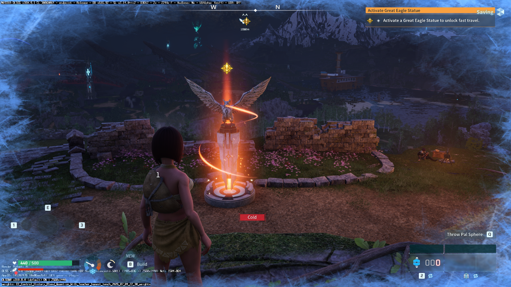
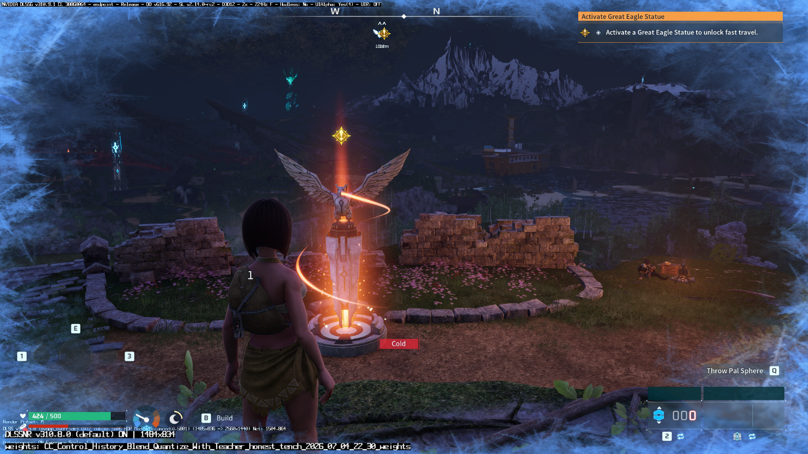
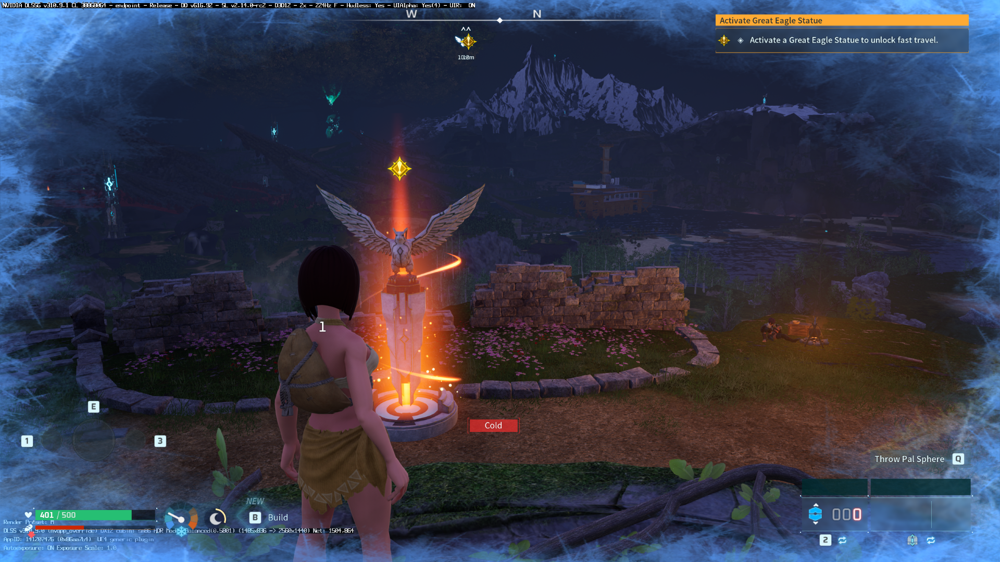
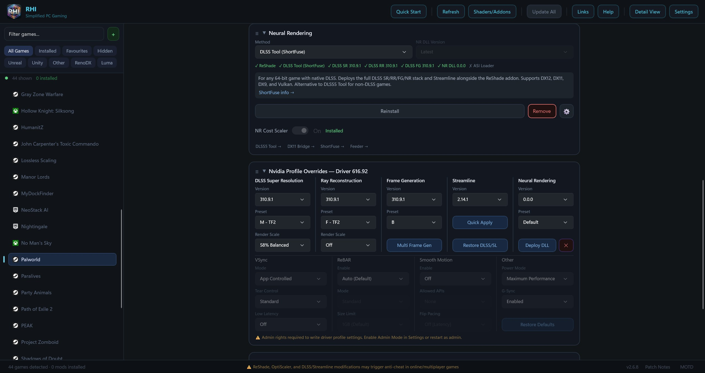

# Palworld: DLSSG, Neural Rendering and RHI

English | [简体中文](GALLERY.zh-CN.md) | [Français](GALLERY.fr.md) · [Installation](README.md)

User-provided screenshots from an **RTX 3070 Ti Laptop with 8 GB VRAM**.
The gameplay overlay shows **DLSSG 310.9.1, D3D12, X2**. The visible NR indicator
identifies **DLSSNR 310.8.0**. Frame Generation and Neural Rendering are separate
components with separate version numbers.

These illustrate coexistence and visual differences, not a controlled benchmark:
camera position, animation and effects vary. They do not establish motion quality
or FPS. The `224Hz` label in the DLSSG banner is not an FPS measurement.

## NR enabled, full processing resolution

The NR indicator reads `ON | 2560x1440`. This is the clearest supplied example
of the full-resolution NR path; the screenshot does not show the Cost Scaler switch.

## NR enabled, reduced processing resolution

The NR indicator reads `ON | 1484x834`. This shows reduced NR processing resolution.
The user recalls testing NR Cost Scaler around `0.50`, but the exact setting is
not visible, so this image is not labeled as a confirmed `0.50` test.

## NR disabled in the user comparison

The NR indicator is absent, while DLSSG 310.9.1 X2 remains visible. The user's
test identifies this as the NR-disabled comparison. The camera is close to,
but not identical to, the preceding views.

## RHI setup for Palworld

The panel shows **DLSS Tool (ShortFuse)** selected and **NR Cost Scaler** marked
installed. No numeric Cost Scaler value is shown. These are manager settings;
the in-game overlay is the source for the active versions reported above.
In particular, RHI's displayed NR `0.0.0` should not be read as the in-game NR version.

For setup, start with [RHI](https://github.com/RankFTW/RHI). Support its authors
and [ShortFuse's RenoDX](https://github.com/clshortfuse/renodx) with a GitHub star ⭐.
